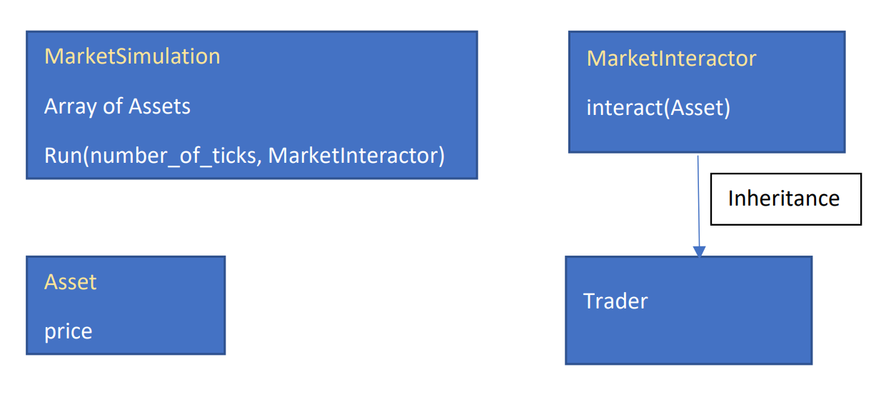

# IB9JHO Lab 10: Market Simulation

In this lab we will improve a simple simulation for an asset market. The prices for each asset 
in the market will be governed by log-Brownian motion with a fixed volatility and zero-drift throughout time. Time 
is split up into increments called ticks, which is an arbitrary quantity that could mean seconds, 
minutes, years etc. We will interact with the market (buy and sell assets) at some predefined interval 
of ticks by defining a class which inherits from the MarketInteractor class (see class 
structure below).

An example of inheriting the MarketInteractor class is already provided by the 
Trader class. Note that the MarketSimulation can currently only have one MarketInteractor at once 
to trade its assets. You are recommended to inspect each of these classes and get an idea of how 
they work before attempting the exercises

# Exercise 1:
The code provided initially does not compile. Fix this by adding the appropriate inheritance 
relationship to reflect the class structure in the diagram above. Use public inheritance.

# Exercise 2:
Currently, a Trader object can sell assets, but it cannot buy them, so our simulation does not do 
much. Implement the Trader::buy function, which will take an asset name, asset price, and 
amount as input. It should buy the specified amount of an asset and add it to the trader’s portfolio. If there is 
not enough cash to buy the full amount it should buy as much as it can. The completed
implementation will be similar to the Trader::sell function.
Run test_trader to check the implementation

# Exercise 3:
The simulation needs one more thing to work properly, as currently the price of each asset is 
constant throughout time. To this end we need to modify the Asset::tick_update() function so that 
the price is stochastic and incremented at each stage with a log-brownian increment.

fixed volatility =: 𝜎
initial price =: 𝑃0

At tick n and time t𝑛:
price at t𝑛 =: 𝑃𝑛
And 𝑃𝑛+1 = exp(log(𝑃𝑛) + 𝜖) where 𝜖 ~ 𝑁(0, 𝜎^{2})

 
Hint:
You will need to use std::normal_distribution and the static variable in the Asset class RANDOM_GENERATOR.

Now you should be able to run the code in main.cpp and see the output. Inspect the code in main.cpp to see how the classes are used. In this case, a single simulation is set up and 10 traders will trade for it for 10000 ticks each. After each trader is finished trading, the total revenue (negative if they lost money) for the trader is printed out.

# Exercise 4:
Using the Trader class as a guide, make your own class which inherits from MarketInteractor and trades with the market. Currently the methodology used by Trader, which is described below, is rather simplistic and quite wild fluctuations in revenue. See if you can design a more profitable/less erratic trader than Trader. Design a suitable test through a series of simulations to investigate whether your trader is better than the original. The Trader class currently uses the 50-tick moving average of an asset to make a buy or sell decision. You can see the code for this in Trader::determine_buy_amount and Trader::determine_sell_amount. For instance, if the current price is less than 95% of the moving average, the asset is considered undervalued and will be bought up using all the cash the trader has. 

# Submission
Once you have tested your solutions, submit your work by pushing your changes to the repository.
You can use the commit message "Submit assignment" or something similar.